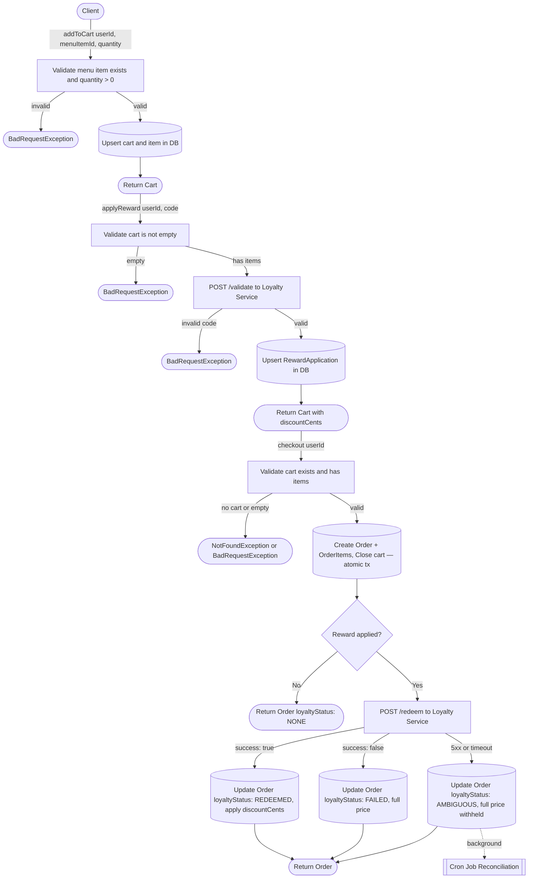

## Written Prompts

### 1. System Overview
Describe the end-to-end checkout flow, including how you handle the loyalty service integration. A diagram is welcome but not required.

The main system flow are these mutations: addToCart(), applyReward(), and checkout() in order.
- addToCart()
  - Arguments: userId, menuItemId, quantity
  - Validations: Menu item exists and quantity is larger than 0
  - Function: Adds existing menu item to the user's cart
- applyReward()
  - Arguments: userId, code
  - Validations: Cart is not empty, reward is valid from the external loyalty service
  - Function: Sends a request to the external loyalty service to validate if a reward is valid
  - Returns: the subtotalCents, discountCents, totalCents, reward: code, discountCents, status
  - External Integration:
    - Valid: Upserts a reward application row in the DB.
    - Invalid: Throws an error
- checkout()
  - Arguments: userId
  - Validations: Cart exists, cart has at least 1 item
  - Function: Checkout the users cart
  - Returns: checkoutId, subtotalCents, discountCents, totalCents, loyaltyStatus, redemptionId, items: name, priceCents, quantity, lineCents (priceCents * quantity)
  - External Integration
    - If the cart has a reward attached to it we call the external loyalty service. We call the /redeem function. If the service comes back with a success we apply the discount, update the order with the discounted price and loyaltyStatus = REDEEMED. On a failure from the loyalty service we do not apply the discount and set loyaltyStatus = FAILED. On 5xx or timeout errors we set loyaltyStatus = AMBIGUOUS and do not discount. If this were a real production application, a cron job would run checking these ambiguous reward applications for reconciliation. I created a mock alert system that would log these errors.

### 2. Failure Handling
Explain how your system behaves when the loyalty service is slow, returns errors, or is completely unavailable. What trade-offs did you make between correctness and availability?

- Timeouts
  - Both loyalty endpoints have hardcoded timeouts: /validate at 5 seconds, /redeem at 10 seconds. If /validate times out the reward cannot be applied — the cart proceeds at full price and the customer must retry. This is safe because /validate is read-only; nothing was recorded on the loyalty service's side. If /redeem times out the situation is ambiguous — the loyalty service may have processed the redemption before the connection dropped. We do not apply the discount but set loyaltyStatus = AMBIGUOUS so a cron job or support team can confirm the outcome and apply the discount to this order if the redemption succeeded.
- 5xx errors
  - A 5xx from /redeem is treated the same as a timeout: loyaltyStatus = AMBIGUOUS. The loyalty service has a ghost failure mode where it records the redemption successfully and still returns 500, so we cannot safely treat 5xx as a definitive failure. A 5xx from /validate is treated as a hard failure — the reward is not applied and the customer is notified.
- Completely unavailable
  - If the loyalty service is unreachable at the network level (connection refused, DNS failure) before the request lands, we know with certainty nothing was recorded on their side. /validate throws immediately so the reward cannot be applied. /redeem sets loyaltyStatus = FAILED and charges full price — no ambiguity because the request never reached the service.
- Availability vs. consistency
  - The system chooses availability over consistency of the discount. The order always completes — the customer's food gets made regardless of what the loyalty service does. The trade-off is that the discount may be delayed: if /redeem is ambiguous, the customer sees full price until reconciliation confirms the outcome and applies the discount to this order. The alternative — blocking checkout until the loyalty service responds — could hold a hungry customer for up to 10 seconds on a timeout, which is an unacceptable UX cost for a discount. If we could never move away from this service we could use a queue like SQS to achieve faster UX. After checkout, we set loyaltyStatus = PENDING, another service is subscribed to this queue and /redeem is called to update the orders loyaltyStatus and discount based on the result. The trade-off here is the customer won't have visibility if their discount went through. To try to resolve this we can use push notifications, either email or phone, to keep the customer updated.

### 3. Data Model
Walk us through your data model. How do you represent carts, orders, and the reward lifecycle? How would this model evolve if we added multiple users or payment processing?

- MenuItem
  - Represents available menu items. Fields: id, name, priceCents, available. The available flag allows items to be toggled off the menu without deleting them, preserving historical order references.

- Cart / CartItem
  - Cart represents a user's active shopping session. Fields: id, userId, status (OPEN, CHECKED_OUT). A user can only have one OPEN cart at a time. CartItem is a join between Cart and MenuItem storing the quantity selected. When checkout is called, the cart is moved to CHECKED_OUT in the same DB transaction that creates the order, preventing a cart from being checked out twice.

- RewardApplication
  - Represents a loyalty reward attached to a cart. Fields: code, rewardId, discountCents, status. It is stored as a separate row rather than on the Cart itself so it can be upserted, removed, and carried through to the order independently. The rewardId comes from the external loyalty service and is used as an idempotency anchor when calling /redeem.

- Order / OrderItem
  - Created from a cart at checkout. Fields: subtotalCents, discountCents, totalCents, loyaltyStatus, redemptionId. The order is always created at full price first — discountCents is only updated after /redeem explicitly confirms success. OrderItem snapshots the item name and priceCents at the time of purchase so price changes to MenuItem do not retroactively affect historical orders.

- Reward lifecycle
  - NONE -> no reward was applied to the cart
  - PENDING -> reward was on the cart, /redeem not yet called
  - REDEEMED -> /redeem confirmed, discount applied to totalCents
  - FAILED -> definitive rejection (already_redeemed) or service unreachable, full price charged
  - AMBIGUOUS -> /redeem returned 5xx or timed out, discount withheld pending reconciliation

- Evolution
  - Multiple users
    - The model already supports multiple users — userId is stored on both Cart and Order. Adding real authentication would mean extracting the authenticated userId from a JWT in a middleware guard rather than accepting it as an argument, and adding a Users table for profile context. That opens the door for order history, saved billing info, and personalized recommendations without any schema changes to the core cart or order models.
  - Payment processing
    - I'd add a Payment model linked to Order with fields for paymentMethod (credit, Apple Pay, Google Pay), status (PENDING, CAPTURED, FAILED), and paymentIntentId for idempotency with the payment processor. The paymentIntentId ensures that if our checkout call is retried we never create two charges for the same order. The kitchen should only start the order once payment is confirmed — so we'd integrate a webhook from the payment processor. On a payment.captured event we'd update the order status to CONFIRMED and notify the kitchen. If a loyalty reconciliation later reduces totalCents after payment is already captured, we'd issue a partial refund via the payment processor or by in app points rather than adjusting the order total in place.

### 4. Observability
If this were a production service, what metrics, logs, or alerts would you add? How would you know if the loyalty integration was degraded before customers started complaining?

- Loyalty service alerts
  - The mock alert service already fires on every 5xx and timeout from the loyalty service. In production these would route to a real Slack channel as a v0 — enough visibility to catch an incident early without requiring infrastructure. The key metrics to track on the loyalty integration are 5xx error rate, p95 response latency, and the rate of orders entering AMBIGUOUS status. The AMBIGUOUS rate is the most useful business-level signal: it directly represents orders with unresolved discounts and a growing reconciliation backlog. A spike there means the loyalty service is degrading even if it hasn't fully gone down yet.

- Knowing before customers complain
  - p95 latency crossing a threshold (e.g. >2s) will fire before timeouts start accumulating, giving time to investigate before customers feel it. AMBIGUOUS rate ticking up is another leading indicator — customers haven't called support yet but discounts are already being withheld. These two metrics together give early warning of a degraded loyalty service.

- Logging
  - Errors are logged at the boundary where a decision is made — in the catch blocks of the loyalty service and order service — rather than wrapping every function indiscriminately. This keeps logs meaningful and avoids swallowing errors that should propagate. In production each log entry would include orderId, rewardId, and the error cause so a single log line is enough to diagnose an incident without cross-referencing multiple sources.

- Mature alerting
  - A more mature setup would use Datadog with thresholds on 5xx error rate and p95 latency evaluated over a short window (~5 minutes) to catch incidents fast. AMBIGUOUS order rate would be tracked as a business metric with its own dashboard so the support team can monitor reconciliation backlog independently of the engineering on-call.

### 5. Technology Choices
Why did you choose your language/framework? What would you choose differently if this were a high-throughput production service?

- NestJS
  - NestJS has been growing in popularity the last couple of years. It provides an opinionated approach to building out enterprise level apps with modules, controllers, and dependency injection. I usually use Express for side projects or takehomes because of it's simplicity, but when you are dealing with serious topics such as payment, having a strict framework ensures maintainability. I also knew that Sweetgreen uses this internally so it wouldn't hurt.
- GraphQL
  - I chose code-first GraphQL with Apollo. Maintaining the schema by hand can cause a lot of issues - it's prone to merge conflicts. Having one less thing to maintain also lets you focus on code. REST definitely could've been applied here since it's a small project, and our responses aren't big. I was building this with the mindset that frontend will eventually use our backend. Having graphQL gives the frontend devs what they need to work with. A lot of the time, backend can get a head start on features even before the designs come out. So by the time FE needs to integrate, all the data they need to fetch is already there. 
- Typescript
  - Simply because it's the programming language I'm most comfortable with. When deciding on languages and frameworks to use, the largest concern I have is team experience. No learning curve gets your product out quicker and better since we are familiar with our tools and won't run into any abnormality.
- Postgres and Prisma
  - PostgresSQL is easily the most popular database i've run into at my job, it has quite a large following. Online documentation is another thing I consider when choosing a new technology, and pgSQL has plenty. I also chose postgres because of the amount of relations I saw in this project. Menu items to carts, carts to orders, and carts to rewards. 
  - Prisma has great documentation and is always constantly updated. It also has a lot of built in tools, for example, their schema vizualizer, prisma studio negates the need for pgAdmin, types are automatically generated, querying is human readable, and migrations are graciously handled. 
- Jest
  - It's the testing framework I've used the most with JS/TS. It's great with mocking, TS support, NestJS automatically configures it by default.
- Changes for a high-throughput production service
  - Redis
    - The menu items could easily be cached since that will be a very heavy read operation and rarely change. When an item becomes available/unavailable we invalidate the cache.
  - NestJS
    - Since NestJS is stateless and have Docker set up we can use multiple instances of it behind a load balancer. We can easily use ECS (Elastic Container Service) which we can configure how many instances we want and have it automatically scale from 1 to n depending on load.
  - Postgres
    - Add connection pooling, node by default opens a connection per request. We can use pgBouncer under load to avoid the hard limit Postgres has.
    - If Sweetgreen had restaurants around the world - replication across different regions. Writes go to the primary DB, but menu queries and order history can go to a replica closer to the user.
  - Loyalty Service Queue
    - At high throughput, /redeem needs to move off the checkout critical path entirely. Synchronous external HTTP calls don't scale — any latency spike in the loyalty service directly degrades checkout for every concurrent user. The fix is to enqueue the redemption after the order is created, return immediately to the client with loyaltyStatus = PENDING, and let a background worker call /redeem and update the order. Checkout latency is then decoupled from loyalty service latency regardless of how reliable the loyalty service is.